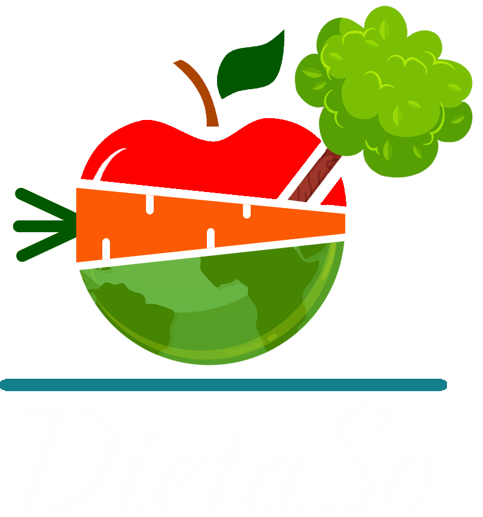

[](https://docs.expo.io/)
[](https://www.npmjs.com/)
[](https://nodejs.org/dist/v14.15.1/docs/api/)
<p align="center">
  <a href="https://github.com/othneildrew/Best-README-Template">
    
  </a>

  <h3 align="center">DietaSo</h3>

  <p align="center">
    A nutritional and ecological application with react native.
    <br />
    <a href="https://www.figma.com/proto/gRJRtkQBGebLt9kRrsC6SV/Mobile-design?node-id=1%3A3&viewport=308%2C200%2C0.141961008310318&scaling=scale-down"><strong>Explore the prototype »</strong></a>
    <br />
    <br />
  </p>
</p>

### Built With

This section should list any major frameworks that you built your project using. Leave any add-ons/plugins for the acknowledgements section. Here are a few examples.
* [NodeJs](https://nodejs.org/en/)
* [ExpressJs](https://expressjs.com/)
* [ExpoCLI](https://docs.expo.io/)

### Prerequisites
* npm
  ```sh
  npm install --global expo-cli
  ```

### Installation

1. Clone the repo
   ```sh
   git clone https://github.com/ClawGibson/Aplicaci-nNutricionalEcol-gica.git
   ```
2. Install NPM packages
   ```sh
   npm install
   ```
3. Create your .env file `App\Backend\.env`
   ```.env
   MONGODB = 'Request the url from the administrator'
   API_URL = 'Request the url from the administrador'
   PORT =  'Enter your favorite port'
   ```

<!-- CONTRIBUTING -->
## Contributing

Contributions are what make the open source community such an amazing place to be learn, inspire, and create. Any contributions you make are **greatly appreciated**.

1. Fork the Project
2. Create your Feature Branch (`git checkout -b feature/AmazingFeature`)
3. Commit your Changes (`git commit -m 'Add some AmazingFeature'`)
4. Push to the Branch (`git push origin feature/AmazingFeature`)
5. Open a Pull Request


<!-- CONTACT -->
## Contact

Gamaliel Bernal - [Gamaliel Joaquín](https://www.facebook.com/JakousiClaw/) - gamalielbj@gmail.com

Project Link: [https://github.com/ClawGibson/Aplicaci-nNutricionalEcol-gica](https://github.com/ClawGibson/Aplicaci-nNutricionalEcol-gica)


<!-- ACKNOWLEDGEMENTS -->
## Acknowledgements
* [Octavio Bautista](https://github.com/OctavioBautista)
* [Tulio Salazar](https://github.com/TulioA)
